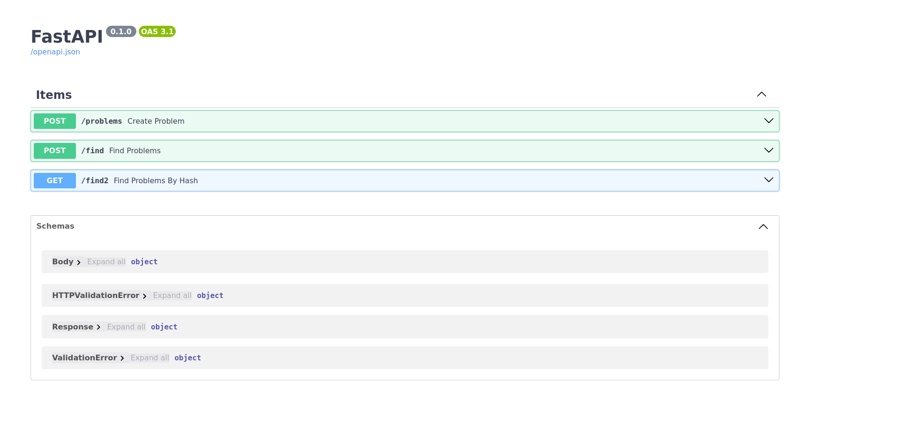

# Система сбора инцидентов

Простой сервис сбора инцидентов

Функциональные части сервиса:
- Создание инцидентов и их запись в базу данных
- Поиск инцидентов в базе данных по набору пар {ключ: значение}
- Поиск инцидентов в базе данных по хэш-сумме записи

### Технологии
- Бэкенд - FastAPI, pydantic, uvicorn, pymongo
- База данных - MongoDB (построены индексы по основным полям)
- Виртуализация - Docker, docker-compose

## Установка
Для начала скопируйте репозиторий и перейдите в папку с проектом:
```
git clone https://github.com/Jericho-kd/incident-collection.git
cd incident-collection
```

## Использование
Для развертывания приложения запустите следующую команду:
```
docker compose up
```

По окончании развертывания приложения перейдите по ссылке http://0.0.0.0:8989/docs

Вы перешли на страницу тестирования API



### Создание инцидента
Для создания инцидента на странице тестирования API раскройте запись /problems и передайте данные в формате
(Headers для формирования записи инцидента автоматически берутся из запроса, поэтому передается только body):
```
{
  "body": {
    "additionalProp1": "string",
    "additionalProp2": "string",
    "additionalProp3": "string"
  }
}
```

Или совершите следующий запрос:
```
curl -X 'POST' \
  'http://0.0.0.0:8989/problems' \
  -H 'accept: application/json' \
  -H 'Content-Type: application/json' \
  -d '{
  "body": {
    "additionalProp1": "string",
    "additionalProp2": "string",
    "additionalProp3": "string"
  }
}'
```
В ответ вы получите хэш-сумму, созданного инцидента:
```
{
  "hash": "eed386a57be703ea61ecb278aba0d569749a3bad0ad9b27ed0b68cc1bc49c4a7"
}
```

### Поиск инцидентов по набору пар {ключ: значение}
Для поиска инцидентов в базе данных на странице тестирования API раскройте запись /find и передайте данные в формате:
```
{
  "additionalProp1": "string",
  "additionalProp2": "string",
  "additionalProp3": "string"
}
```

Или совершите следующий запрос:
```
curl -X 'POST' \
  'http://0.0.0.0:8989/find' \
  -H 'accept: application/json' \
  -H 'Content-Type: application/json' \
  -d '{
  "additionalProp1": "string",
  "additionalProp2": "string",
  "additionalProp3": "string"
}'
```
В ответ вы получите список всех инцидентов, содержащих заданные поля:
```
{
  "result": [
    {
      "header": {
        "accept": "application/json",
        "accept-encoding": "gzip, deflate, br",
        "accept-language": "en-US,en;q=0.5",
        "connection": "keep-alive",
        "content-length": "117",
        "content-type": "application/json",
        "host": "localhost:8080",
        "origin": "http://0.0.0.0:8989",
        "referer": "http://0.0.0.0:8989/docs",
        "sec-fetch-dest": "empty",
        "sec-fetch-mode": "cors",
        "sec-fetch-site": "same-origin",
        "user-agent": "Mozilla/5.0 (X11; Ubuntu; Linux x86_64; rv:109.0) Gecko/20100101 Firefox/116.0"
      },
      "body": {
        "additionalProp1": "string",
        "additionalProp2": "string",
        "additionalProp3": "string"
      }
    }
  ]
}
```

### Поиск инцидентов по хэш-сумме записи
Для поиска инцидентов в базе данных по хэш-сумме записи на странице тестирования API раскройте запись /find2 и передайте хэш-сумму в виде строки:
```
eed386a57be703ea61ecb278aba0d569749a3bad0ad9b27ed0b68cc1bc49c4a7
```

Или совершите следующий запрос:
```
curl -X 'GET' \
  'http://0.0.0.0:8989/find2?h=eed386a57be703ea61ecb278aba0d569749a3bad0ad9b27ed0b68cc1bc49c4a7' \
  -H 'accept: application/json'
```

В ответ вы получите список всех инцидентов, содержащих заданное значение хэш-суммы.

## Тестирование
Находится в разработке


## Вещи, которые можно улучшить
- Добавить обработку исключительных ситуаций при неверных запросах
- Добавить бенчмарки скорости поиска данных в MongoDB с индексами и без индексов
- Добавить скрипт для начальной инициализации базы данных